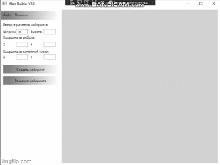

 

  <h3 align="center">Конструктор лабиринтов</h3>
  

    <a href="https://t.me/bisnachauszuvorbei">Телеграм автора</a>
  

  
Оглавление

  <ol>
    <li>
      <a href="#О проекте">О проекте</a>
      <ul>
        <li><a href="#Технологии">Технологии</a></li>
      </ul>
    </li>
    <li><a href="#Демонстрация работы">Демонстрация работы</a></li>
    <li><a href="#Контакты">Контакты</a></li>
  </ol>

### О проекте

___
Это проект, представляющий собой графический редактор/создатель лабиринтов. стенка фиксированного размера, толщина 0, только горизонтальные и вертикальные, на сетке.
Решение получает файл, отрисовывает его, на экране рисует шаги алгоритма. 
Лабиринт в прямоугольнике произвольного размера. 
Задаются размеры лабиринта.
___

### Технологии

Здесь перечисленны технологии, которые использованы для создания
клиентского приложения:

* [C#]() - Поскольку я неплохо знаю C#, стал писать на нём 
* [WPF]() - Платформа Windows Presentation Foundation (WPF) позволяет создавать клиентские приложения для настольных систем Windows с привлекательным пользовательским интерфейсом.
* [.NET 5.0]() — это бесплатная платформа разработки с открытым исходным кодом для создания различных типов приложений.

В принципе в **package.json** есть много других библиотек, но это либо эксперименты не вошедшие в релиз, либо заготовки на
будущее.

### Демонстрация работы

В данный момент релизованы задачи: генерации лабиринта, отображения лабиринта, поиска пути решения лабиринта, сохранения лабиринта, масштабирования.
В данный момент не релизованы задачи: редактирования лабиринта, сохранения лабиринта.

### Контакты

Email - [a.sadilov.official@gmail.com](mailto:a.sadilov.official@gmail.com)
Telegram - [@bisnachauszuvorbei](https://t.me/bisnachauszuvorbei)
